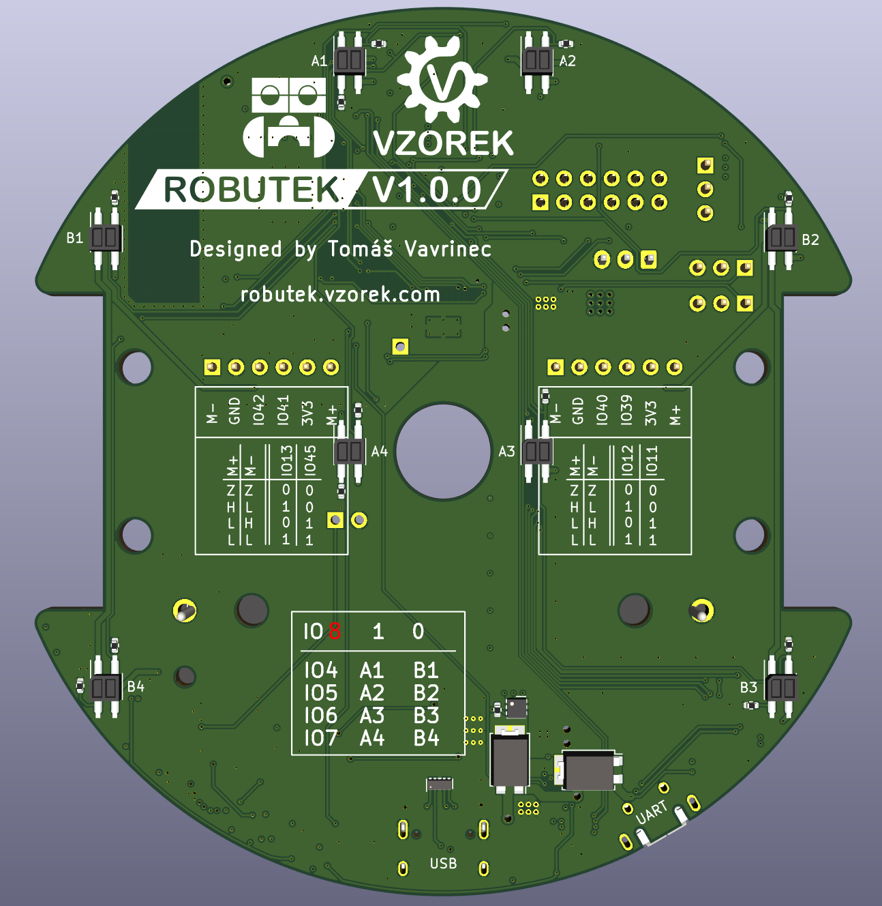

# Programování robota


## Programování:
Robůtek je řízený mikrokontrolérem ESP32-S3. K programování budeme používat jazyk TypeScript, který budeme spouštět pomocí programu [Jaculus](https://jaculus.org/).

[Lekce 1](lekce1/){ .md-button .md-button--primary }

## Přehled pinů
Čísla pinů nemusíte přepisovat ručně, lze použít definici z knihovny:

```typescript
import * as gpio from "gpio";

import { Pins } from "./libs/robutek.js"; // <- definice pinů


gpio.pinMode(Pins.StatusLED, gpio.PinMode.OUTPUT);
gpio.write(Pins.StatusLED, 1)
```

Pro kompletnost je pinout k nahlédnutí zde:

```typescript
export enum Pins {
    StatusLED = 46,

    // Jedna na desce a zároveň vývod pro pásek,
    // po připojení externího pásku se tedy jedná
    // o 8 + 1 = 9 diod celkem
    SmartLeds = 48,

    ButtonLeft =  2,
    ButtonRight = 0,

    Servo1 = 21,
    Servo2 = 38,

    Sens1 = 4,
    Sens2 = 5,
    Sens3 = 6,
    Sens4 = 7,

    SensSW = 8,
    SensEN = 47,

    Motor1A = 11,
    Motor1B = 12,
    Motor2A = 45,
    Motor2B = 13,
    Enc1A = 39,
    Enc1B = 40,
    Enc2A = 42,
    Enc2B = 41,
}
```



!!! danger "Pin pro přepínání vnitřních a venkovních čárových senzorů je pin <b>IO8.</b>"
