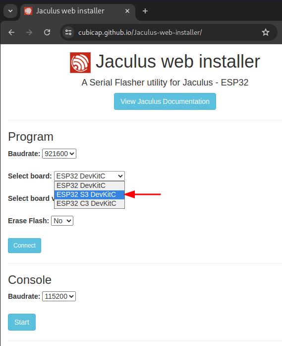
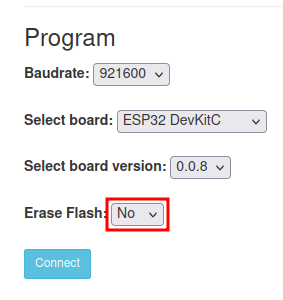
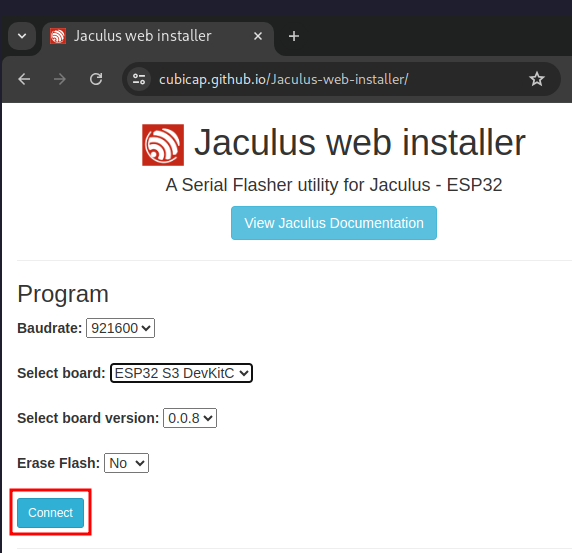
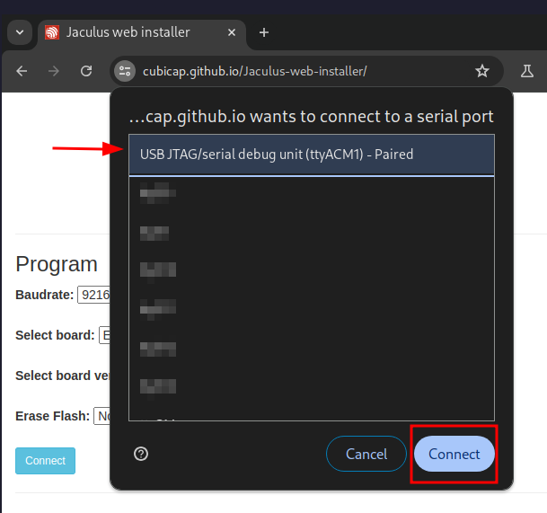
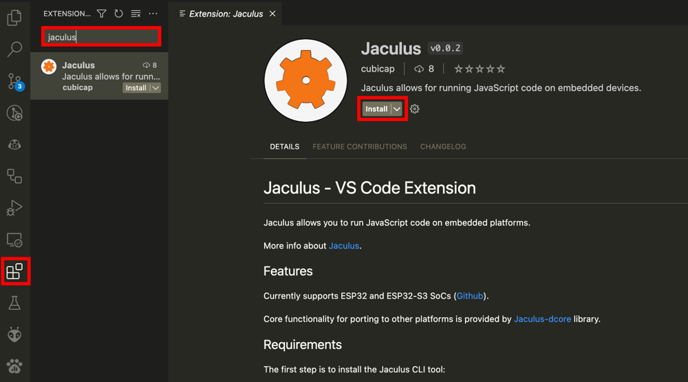
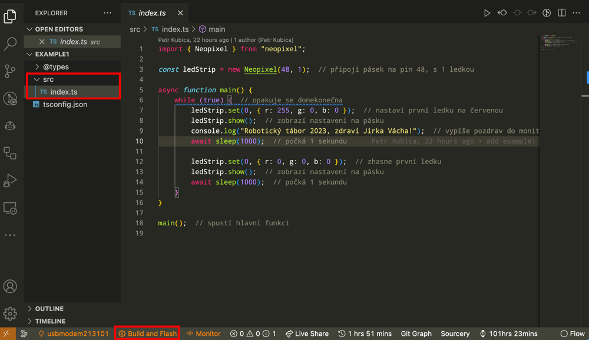

# Lekce 1 - první program

V této lekci si představíme Jaculus, nainstalujeme si programovací prostředí a spustíme první program.

## Instalace

Na našich robotech poběží program, který se jmenuje Jaculus.
Tento program nám umožní jednoduše psát instrukce (programy), které nahrajeme do robota.
Tyto programy budou specifikovat, jak se robot má chovat, a umožní nám s ním komunikovat.
Aby nám všechno správně fungovalo, musíme ho nejprve nainstalovat a k němu i několik dalších programů.

### Jaculus

1. Otevřeme si [Jaculus web installer](https://installer.jaculus.org/) v Chrome nebo Edge.
!!! warning "Tento postup nefunguje ve Firefoxu a jinych prohlížečích nezaložených na chromium"
<hr>

<br>
2. Zvolíme desku `ESP32 S3 DevKitC`<br>
<hr>
<br>
3. Přepínač `Erase Flash` slouží k vymazání programů co už jsou nahrané na ESP. V defaultním stavu na `No` nevymaže programy na ESP.<br> 
<hr>

4. Zapneme Robůtka a podržíme tlačítko `IO0`. Současně s ním zmáčkneme tlačítko nalevo od tlačítka - `IO0` což je tlačítko `RESET`. Tímto si přepneme robůtka do tzv. boot módu. 
<hr>
<br>
5. Po připojení Robůtka v boot módu k počítači stiskneme v Jaculus web instalátoru tlačítko `Connenct`<br>
<hr>
<br>
6. V pop-up okénku zvolíme port `COM` na Windows nebo `ttyACM` na unix-like systémech a stiskneme 
**Connect**<br>
<hr>
<br>
7. Po chvilce se nám zobrazí tlačítko **flash**, které zmáčkneme.<br>
!!! tip "když vám flash přes USB-C nepojede zkuste Micro-USB"
<hr>

8. Chvilku počkáme a jakmile přestanou v konzoli přibývat nové řádky, tak máme nainstalovaného Jacula!


### Node.js

`node.js` je knihovna, která nám umožní stáhnout nástroje na používání Jacula.

1. Stáhneme si [Node.js](https://nodejs.org/en/download) (nejnovější stabilní verzi - LTS)
2. Nainstalujeme jej dle výchozího nastavení (není potřeba nic měnit).

### Visual Studio Code

Visual Studio Code je programovací prostředí, které nám umožní psát kód a s rozšířením nám dovolí nahrávat kód do zařízení.

1. Stáhneme si [Visual Studio Code](https://code.visualstudio.com/download) (nejnovější stabilní verzi)
2. Nainstalujeme jej dle výchozího nastavení (není potřeba nic měnit).

### Jaculus

Nyní už se můžeme vrhnout na samotnou instalaci [`Jacula`](https://jaculus.org/getting-started/).

1. Po instalaci `node` **restartujeme** aplikaci Visual Studio Code.
2. V horním menu VSCode vybereme záložku `Terminal` a zvolíme `New Terminal`.
3. Do terminálu zadáme příkaz vypsaný níže. Na `Linuxu` bude nejspíše potřeba `sudo` práva.

	```bash
	npm install -g jaculus-tools
	```

	??? tip "Háže mi to chybu"
		Pro aplikování všech změn je nutný restart VSCode. Pokud se vám nedaří nainstalovat Jaculus, zkuste nejdříve restartovat VSCode.

4. Pro otestování instalace zadáme do terminálu příkaz:

	```bash
	npx jac
	```

	Program by měl vypsat nápovědu.

	??? info "Ukázka nápovědy"
		```bash
		Usage: jac <command>

		Tools for controlling devices running Jaculus

		Commands:
		help           Print help for given command
		list-ports     List available serial ports
		serial-socket  Tunnel a serial port over a TCP socket
		install        Install Jaculus to device
		build          Compile target file
		flash          Flash code to device (replace contents of ./code)
		pull           Download a file/directory from device
		ls             List files in a directory
		read           Read a file from device
		write          Write a file to device
		rm             Delete a file on device
		mkdir          Create a directory on device
		rmdir          Delete a directory on device
		upload         Upload a file/directory to device
		start          Start a program
		stop           Stop a program
		status         Get status of device
		version        Get version of device firmware
		monitor        Monitor program output

		Global options:
		--log-level   Set log level (default: info)
		--help        Print this help message
		--port        Serial port to use (default: first available)
		--baudrate    Baudrate to use (default: 921600)
		--socket      host:port to use
		```


### Jaculus VSCode Rozšíření

Rozšíření pro VSCode nám umožní jednoduše nahrávat kód do Jacula pomocí ikonek a klávesových zkratek.

1. V levém menu VSCode vyberte záložku `Extensions` a vyhledejte `Jaculus`.
	
2. Zvolte `Install`.
3. Po otevření projektu by se vám ve spodní liště měly objevit oranžové ikonky Jacula.
   	

??? note "Používám Windows a nemůžu se připojit přes USB UART"
	Pokud se vám nedaří připojit na USB UART port, je nutné doinstalovat správné drivery.

	1. Stáhněte si <a target="_blank" href="https://www.silabs.com/developers/usb-to-uart-bridge-vcp-drivers">driver</a> pro váš operační systém. Naleznete jej v záložce `Downloads -> Software -> CP210x Universal Windows Driver`.
	2. Rozbalte ZIP soubor a poté pravým tlačítkem klikněte na `silabser.inf` a vyberte `Install`.
	3. Vyzkoušejte, zda se vám podařilo připojit Jaculus. (možná budete muset restartovat počítač).


## První projekt

Zde si vyzkoušíme vytvořit první projekt a nahrát jej do Robůtka.

[Stáhnout ZIP s prvním projektem](./example1.zip){ .md-button .md-button--primary }


1. V prvním kroku si na počítači nachystáme složku `RoboCamp-2024` do které si budeme ukládat veškeré projekty.
2. Dále si [stáhneme zip](./example1.zip) soubor s prvním projektem.
3. Poté si jej **rozbalíme** do vytvořené složky k táboru.
4. Spustíme VSCode a pomocí záložky `File` -> `Open Folder` vybereme složku s projektem.
5. Připojíme Robůtka přes `USB-C`. `micro-USB` požívejte primárně pokud nefunguje nahrávání přes `USB-C`.
6. V levém spodním rohu vybereme :material-power-plug:`Select COM port` pro výběr portu, na kterém je Robůtek připojený. Poté se nápis změní na vybraný port.

	??? tip "Mám více portů"
		Pokud se vám v nabídce zobrazí více portů, odpojte Robůtka a zjisťe, který port zmizel. Po připojení Robůtka tento port vyberte.
7. Dále zvolíme :material-eye:`Monitor`, ten slouží pro komunikaci se zařízením.

## Nahrání programu

Pokud nám všem funguje připojení na :material-eye:`Monitor` a běží nám komunikace se zařízením, můžeme si tam zkusit nahrát náš první kód.

1. Ve VSCodu máme otevřený první projekt. V levém `Exploreru` (`Průzkumníku`) vybereme soubor ze  `src` -> `index.ts`. V něm vidíme náš první program.
2. Poté zvolíme :octicons-gear-16:`Build and Flash` pro nahrání programu do zařízení.
	
3. Stejně jako v předchozí části kliknem na tlačítko :material-eye:`Monitor`. Měli bychom vidět výstup z programu.
	```bash
	$ jac monitor --port /dev/tty.usbmodem213101
	Connecting to serial at /dev/tty.usbmodem213101 at 921600 bauds... Connected.

	Robotický tábor 2024, zdraví Jirka Vácha!
	Robotický tábor 2024, zdraví Jirka Vácha!
	```
4. Pro ukončení terminálu, do něj klikneme a stiskneme ++ctrl+c++.
## Úprava programu

Pokud nám funguje nahrávání kódu, můžeme se na něj podívat a zkusit jej upravit.
Ve zdrojovém kódu jsou komentáře (`// tohle je komentář`), které nám popisují, co který řádek dělá.

1. Prostudujeme si zdrojový kód.
2. Upravíme si pozdrav na své jméno.

	??? note "Řešení"
		```ts
		...
		console.log("Robotický tábor 2024, zdraví Franta Flinta!");  // tady jsem změnil své jméno
		...
		```

3. Pokusíme se změnit rychlost vypisování.

	??? note "Řešení"
		```ts
		...
		setInterval(() => { /* moj kod */ }, 500); // čas opakování se udává v milisekundách (1000 ms je 1 sekunda)
		...
		```

4. Upravíme si barvu.

	??? note "Řešení"
		```ts
		...
		Robutek.ledStrip.set(0, colors.red); // nastaví barvu LED na ESP32 na červenou
		...
		```

		Barvy:

		- `red`
		- `orange`
		- `yellow`
		- `green`
		- `light_blue`
		- `blue`
		- `purple`
		- `pink`
		- `white`
		- `off`


## Ovládání robota přes mobil


[Stáhnout ZIP s gridui examplem](./example-gridui.zip){ .md-button .md-button--primary }

1. Musíme si stáhnou předpřipravený gridui ukázkový projekt, ten můžeme rovnou nahrát do Robůtka.

2. Dole na liště klikneme na `Config WiFi`

 <br>
3. Vyberte možnost `Add a WiFi network`

 <br>
4. Do pole zadejte název WiFi sítě `TechnikaNaVylete`

 <br>
5. Dole v terminálu zadejte heslo WiFi sítě `huratabor`

 <br>
6. Znovu klikneme na `Config WiFi` a vybereme `Set WiFI to Station mode (connect to wifi)`