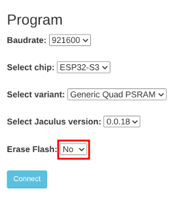
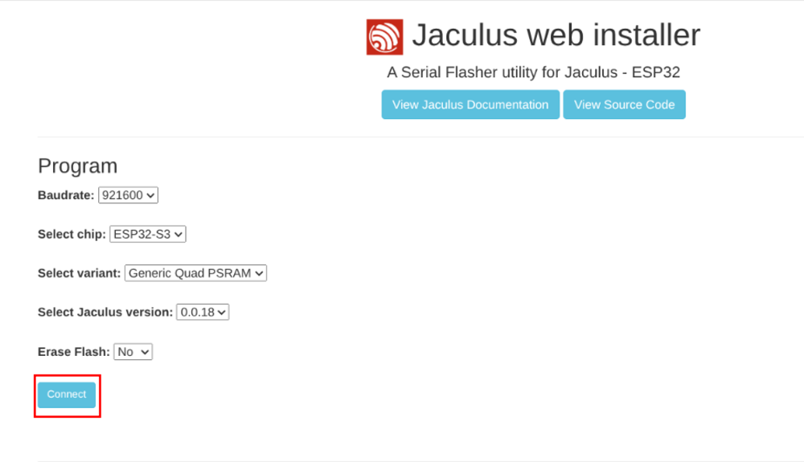
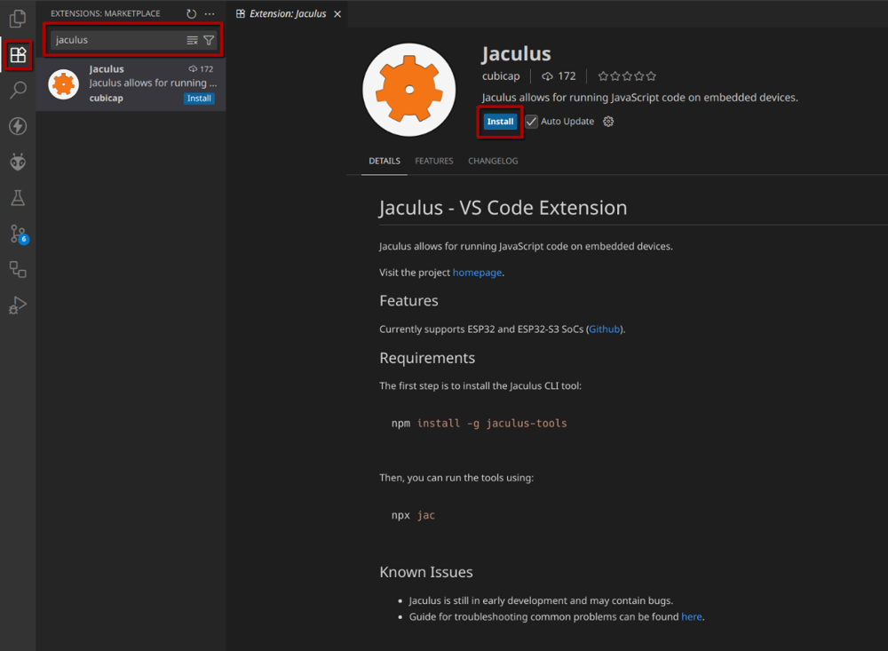

# Lekce 0 - Instalace prostředí

V této lekci si představíme Jaculus, nainstalujeme si programovací prostředí a spustíme první program.

## Instalace

Na našich robotech poběží program, který se jmenuje Jaculus.
Tento program nám umožní jednoduše psát instrukce (programy), které nahrajeme do robota.
Tyto programy budou specifikovat, jak se robot má chovat, a umožní nám s ním komunikovat.
Aby nám všechno správně fungovalo, musíme ho nejprve nainstalovat a k němu i několik dalších programů.

### Jaculus

#### Linux

Na linuxu je třeba přidat oprávnění udev, [více zde](https://docs.espressif.com/projects/esp-idf/en/v5.2.2/esp32s2/api-guides/dfu.html#udev-rule-linux-only).

#### Instalace Jacula

1. Otevřeme si [Jaculus web installer](https://installer.jaculus.org/?baudrate=921600&chip=ESP32-S3&variant=ESP32-S3-Generic-QuadPSRAM&version=latest&erase=noErase) v Chrome nebo Edge.

    !!! warning "Tento postup nefunguje ve Firefoxu a jinych prohlížečích, které nepodporují rozhraní WebSerial."

2. Zvolíme desku `ESP32-S3` a variantu `Generic Quad PSRAM`

    


3. V přepínači `Select board version` vybereme nejnovější dostupnou verzi (tzn. tu s nejvyšším číslem).

4. Přepínač `Erase Flash` slouží k vymazání programů co už jsou nahrané na ESP. Ve výchozím stavu `No` nevymaže programy v ESP.

    

    !!! danger "Přepnutí do Nahrávacího módu"
        Zapneme Robůtka a podržíme tlačítko `IO0`. Současně s ním zmáčkneme tlačítko s popiskem `EN`, které se nachází nalevo od něj. Tímto přepneme robůtka do nahrávacího režimu.

5. Připojíme Robůtka k počítači přes `USB-C`

6. Po připojení Robůtka k počítači stiskneme na webové stránce tlačítko `Connect`.

    


7. Ve vyskakovacím okénku zvolíme port `COM` na Windows nebo `ttyACM` na unixových systémech a stiskneme `Connect`.

    


8. Po chvilce se nám zobrazí tlačítko `Flash`, které zmáčkneme.

    

    !!! tip "když nahrávání přes USB-C nefunguje zkuste Micro-USB"


9. Chvíli počkáme a jakmile přestanou v konzoli přibývat nové řádky, máme nainstalovaného Jacula v mikrokontroléru!


### Node.js

Node.js je program, který nám umožní nahrávat kód do Jacula a komunikovat s ním.

1. Stáhneme si [Node.js](https://nodejs.org/en/download) (nejnovější stabilní verzi - LTS) - [Stahuj ZDE pro Windows](http://files.lan/)
2. Nainstalujeme jej dle výchozího nastavení (není potřeba nic měnit).

### Visual Studio Code

Visual Studio Code je programovací prostředí, které nám umožní psát kód a s rozšířením nám dovolí nahrávat kód do zařízení.

1. Stáhneme si [Visual Studio Code](https://code.visualstudio.com/download) (nejnovější stabilní verzi)  - [Stahuj ZDE pro Windows](http://files.lan/)
2. Nainstalujeme jej dle výchozího nastavení (není potřeba nic měnit).

### Jaculus

Nyní už se můžeme vrhnout na samotnou instalaci [`Jacula`](https://jaculus.org/getting-started/).

1. Po instalaci `node.js` **restartujeme** aplikaci Visual Studio Code.
2. V horním menu VSCode vybereme záložku `Terminal` a zvolíme `New Terminal`.
3. Do terminálu zadáme příkaz vypsaný níže. Na `Linuxu` bude nejspíše potřeba `sudo` práva.

    ```bash
    npm install -g jaculus-tools
    ```

    ??? tip "Dostávám chybu"
        Pro aplikování všech změn je nutný restart VSCode. Pokud se vám nedaří nainstalovat Jaculus, zkuste nejdříve restartovat VSCode.

4. Pro otestování instalace zadáme do terminálu příkaz:

    ```bash
    npx jac
    ```

    Program by měl vypsat nápovědu.

    ??? info "Ukázka nápovědy"
        ```
        Usage: jac <command>

        Tools for controlling devices running Jaculus

        Commands:
        help            Print help for given command
        list-ports      List available serial ports
        serial-socket   Tunnel a serial port over a TCP socket
        install         Install Jaculus to device
        build           Build TypeScript project
        flash           Flash code to device (replace contents of ./code)
        pull            Download a file/directory from device
        ls              List files in a directory
        read            Read a file from device
        write           Write a file to device
        rm              Delete a file on device
        mkdir           Create a directory on device
        rmdir           Delete a directory on device
        upload          Upload a file/directory to device
        format          Format device storage
        resources-ls    List available resources
        resources-read  Read a resource from device
        get-examples    Get example project from device
        start           Start a program
        stop            Stop a program
        status          Get status of device
        version         Get version of device firmware
        monitor         Monitor program output
        wifi-get        Display current WiFi config
        wifi-ap         Set WiFi to AP mode (create a hotspot)
        wifi-add        Add a WiFi network
        wifi-rm         Remove a WiFi network
        wifi-sta        Set WiFi to Station mode (connect to a wifi)
        wifi-disable    Disable WiFi

        Global options:
        --log-level   Set log level (default: info)
        --help        Print this help message
        --port        Serial port to use (default: first available)
        --baudrate    Baudrate to use (default: 921600)
        --socket      host:port to use
        ```


### Jaculus VSCode Rozšíření

Rozšíření pro VSCode nám umožní jednoduše nahrávat kód do Jacula pomocí ikonek a klávesových zkratek.

1. V levém menu VSCode vyberte záložku `Extensions` a vyhledejte `Jaculus`.
    
2. Zvolte `Install`.
3. Po otevření projektu by se vám ve spodní liště měly objevit oranžové ikonky Jacula.
    

??? note "Používám Windows a nemůžu se připojit přes USB UART"
    Pokud se vám nedaří připojit na USB UART port, je nutné doinstalovat správné drivery.

    1. Stáhněte si <a target="_blank" href="https://www.silabs.com/developers/usb-to-uart-bridge-vcp-drivers">driver</a> pro váš operační systém. Naleznete jej v záložce `Downloads -> Software -> CP210x Universal Windows Driver`.
    2. Rozbalte ZIP soubor a poté pravým tlačítkem klikněte na `silabser.inf` a vyberte `Install`.
    3. Vyzkoušejte, zda se vám podařilo připojit Jaculus. (možná budete muset restartovat počítač).

!!! tip "Něco ti nefunguje?"
    Podívej se na [Časro kladené dotazy](../faq/index.md)