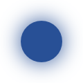
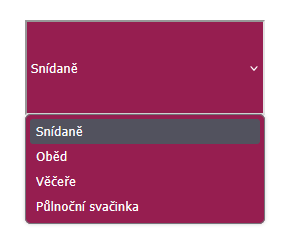
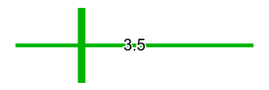
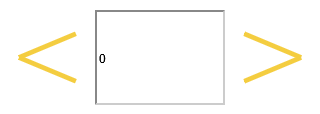

# Widgety
[GridUI designer](https://gridui.robotikabrno.cz/) nám nabízí spoustu různých widgetů, ale co všechno s nimi dokážeme vyvádět? Tady jich většinu projdeme a ukážeme si všechny informace, které jsme schopni ze jednotlivých widgetů tahat a naopak co u nich všechno můžeme kódem nastavovat.

[GridUI designer](https://gridui.robotikabrno.cz/){ .md-button .md-button--primary }

[Stáhnout ZIP s prázdným projektem](blank-gridui.zip){ .md-button .md-button--primary }

## Obecné vlastnosti

Nejprve však zopakování obecných vlastností z [předchozího bloku](index.md). U každého widgetu si v designeru nastavujeme několik obecných vlastností: `id` widgetu a jeho pozici (`x` a `y`) a velikost (výška `h` a šířka `w`). Tyto vlastnosti jsme z robůtka schopni pouze číst a ne upravovat.


!!! NOTE "Na obrázku si všimnete ještě dvou dalších řádků: `tab` a `css`. Vlastnosti `tab` se budeme věnovat v budoucím bloku (až ho vyrobím)."

K vlastnostem widgetu přistupujeme pomocí `id` příkazem `Layout.<id>.<vlastnost>`. Budeme-li tedy mít na rozhraní nějaký widget s `id = mujWidget`, jeho výšku přečteme příkazem `Layout.mujWidget.widgetH`, x-ovou souřadnici příkazem `Layout.mujWidget.widgetX` atd.

## Bar


U widgetu Bar můžeme nastavovat a číst následující vlastnosti: barvu, velikost fontu popisku, zobrazení popisku (true/false), minimální a maximální hodnotu a aktuální hodnotu.
```ts
Layout.Bar1.color = "rgb(150 0 85)"; // barva
Layout.Bar1.fontSize = 20; // velikost fontu popisku
Layout.Bar1.showValue = true; // určuje, zobrazí-li se popisek

Layout.Bar1.min = 10; // minimální hodnota
Layout.Bar1.max = 50; // maximální hodnota
Layout.Bar1.value = 0; //aktuální hodnota
```

## Tlačítko


U widgetu Button (tlačítko) můžeme hlavně číst, jestli je zmáčknuté nebo ne. Taky můžeme uvnitř funkce `Layout.begin()` definovat, co se stane při zmáčknutí a puštění tlačítka.
```ts
const OWNER = "owner";
const DEVICE_NAME = "robutek";

Layout.begin(OWNER, DEVICE_NAME, builder => {
    builder.Button1.onPress(state => {
        console.log("Tlačítko bylo zmáčknuto."); // kód spuštěný zmáčknutím tlačítka
    });

    builder.Button1.onRelease(state => {
        console.log("Tlačítko bylo puštěno."); // kód spuštěný puštěním tlačítka
    });
});

setInterval(() => { // jednou za sekundu vypisuje do konzole stav tlačítka (true => je zmáčknuté, false => je puštěné)
    console.log(Layout.Button1.pressed); }, 1000);

```
??? info "A co znamená to `state`?"
    Do proměnné `state` (ve funkci `builder.Button1.onPress()`) se nám ukládá aktuální stav tlačítka (nebo jakéhokoli jiného použitého widgetu) včetně všech jeho vlastností. Uvnitř následujícího bloku kódu tedy můžeme místo `Layout.Button1.color` apod. psát `state.color`. Jde o proměnnou, můžete jí tedy dát jakékoliv jméno.

Také můžeme nastavovat (i číst!) všechny vlastnosti tlačítka, viz následující blok kódu:
```ts
Layout.Button1.text = "Čudlík"; // popisek tlačítka
Layout.Button1.color = "rgb(0 0 0)"; // barva popisku
Layout.Button1.fontSize = 35; // velikost fontu popisku
Layout.Button1.align = "flex-start"; // zarovnání popisku
Layout.Button1.valign = "center"; // vertikální zarovnání popisku

Layout.Button1.background = "rgb(0 200 130)"; // barva tlačítka
Layout.Button1.disabled = false; // určuje, jeli tlačítko zmáčknutelné
```

## Zaškrtávací políčko


U widgetu Checkbox (zaškrtávací políčko) můžeme ve funci `Layout.begin()` definovat, co se stane při změně. Změnou je, pokud je políčko zaškrtnuto nebo odzaškrtnuto.

```ts
const OWNER = "owner";
const DEVICE_NAME = "robutek";

Layout.begin(OWNER, DEVICE_NAME, builder => {
    builder.Checkbox1.onChanged(state => {
        if (state.checked) {
            console.log("Políčko bylo zaškrtnuto.");
        } else {
            console.log("Políčko bylo odzaškrtnuto.");
        }
    });
});
```

Také můžeme nastavovat a číst všechny vlastnosti zaškrtávacího políčka, viz následující blok kódu.

```ts
Layout.Checkbox1.text = "Napsat lekci na GridUI"; // popisek políčka
Layout.Checkbox1.color = "rgb(255 80 130)"; // barva
Layout.Checkbox1.fontSize = 30; // velikost fontu popisku
Layout.Checkbox1.checked = true; // nastavení zaškrtnutí políčka

let stavPolicka = Layout.Checkbox1.checked; // čtení zaškrtnutí políčka, vrací true/false
```
## Kruh


Widget Circle (kruh) je velmi podobný widgetu Bar, má následující příkazy:

```ts
Layout.Circle1.color = "rgb(0 50 222)"; // barva
Layout.Circle1.lineWidth = 25; // tloušťka kruhu

Layout.Circle1.fontSize = 17; // velikost fontu popisku
Layout.Circle1.showValue = true; //zobrazení popisku (true/false)

Layout.Circle1.min = 0; // minimální hodnota
Layout.Circle1.max = 100; // maximální hodnota
Layout.Circle1.value = 75; // jeden konec vybarvené části kruhu
Layout.Circle1.valueStart = 50; // druhý konec vybarvené části kruhu
```
!!! tip "Doporučuji si nejprve ručně pohrát s hodnotama v [designeru](https://gridui.robotikabrno.cz/) a pochopit, co která doopravdy dělá."

## Vstup


Input (vstup) má tři módy: normální textový, číselný a heslový. V heslovém módu se vám zapsaný text zobrazí jako tečky. V `Layout.begin()` můžeme nastavit událost spuštěnou změnou ve vstupu:

```ts
const OWNER = "owner";
const DEVICE_NAME = "robutek";

Layout.begin(OWNER, DEVICE_NAME, builder => {
    builder.Input1.onChanged(vstup =>{
        console.log(vstup.text);
    });
});
```

Opět můžeme číst i nastavovat všechny následující vlastnosti vstupu:

```ts
Layout.Input1.color = "rgb(20 20 200)"; // barva ohraničení vstupu
Layout.Input1.type = "text"; // typ vstupu ("text", "number", "password")
Layout.Input1.disabled = false; // nastavuje, může-li být text ve vstupu změněn
Layout.Input1.text = "superTajneHeslo"; // text ve vstupu
```

## Joystick


U joysticku opět můžeme v `Layout.begin()` nastavit kód zpuštěný změnou jeho polohy nebo kliknutím/ťuknutím na něj. Také můžeme vyčítat jeho pozici pomocí `Layout.<joystickID></JoystickId>.x` a `Layout.<joystickId>.y`.

```ts
const OWNER = "owner";
const DEVICE_NAME = "robutek";

Layout.begin(OWNER, DEVICE_NAME, builder => {
    builder.Joystick1.onClick(joy =>{
        console.log("klik");
    });
    builder.Joystick1.onPositionChanged(joy =>{
        console.log("Pozice joysticku: x = " + joy.x + ", y = " + joy.y);
    });
});
```
!!! info "Joystick předává svou pozici jako souřadnice x a y, které mají hodnoty mezi -32768 a 32768."

Můžeme číst a nastavovat vlastnosti joysticku následujícími příkazy:

```ts
Layout.Joystick1.color = "rgb(0 0 255)"; // barva
Layout.Joystick1.keys = "wasd"; // přiřazené klávesy, viz tip níže
Layout.Joystick1.text = ":D"; // popisek
```
??? tip "`Layout.<joystickId>.keys`"
    Pokud ovládáte robůtka z počítače, můžete joysticku přiřadit čtyři klávesy, které odpovídají směrům nahoru, doleva, dolů a doprava v  tomto pořadí. K tomu slouží `.keys`. Mohli bychom je třeba přemapovat na číslíčka na numpadu a ty používat místo šipek nebo obvyklého WASD.

## LED



LEDka má následující příkazy:

```ts
Layout.Led1.color = "rgb(40 80 150)"; // barva
Layout.Led1.on = true; // určuje, jeli LEDka rozsvícená
```

## Výběr

!!! danger "Čtení ze `.selectedIndex` není momentálně naimplementované a činí tak výběrový widget prakticky nepoužitelným."



Widget Select (výběr) umožňuje uživateli vybrat jednu z předem určených možností. Má metodu `.onChanged` použitelnou uvnitř `Layout.begin()`:

```ts
const OWNER = "owner";
const DEVICE_NAME = "robutek";

Layout.begin(OWNER, DEVICE_NAME, builder => {
    console.log(sel.selectedIndex);
});
```

Můžeme nastavovat a číst tyto vlastnosti:

```ts
Layout.Select1.color = "rgb(255 255 255)";
Layout.Select1.background = "rgb(150 30 80)";
Layout.Select1.disabled = false;
Layout.Select1.options = "Snídaně, Oběd, Věčeře, Půlnoční svačinka";
Layout.Select1.selectedIndex = 3;
```

## Posuvník



Slider (posuvník) má metodu `.onChanged` použitelnou uvnitř `Layout.begin()`:

```ts
const OWNER = "owner";
const DEVICE_NAME = "robutek";

Layout.begin(OWNER, DEVICE_NAME, builder => {
    builder.Slider1.onChanged(slid => {
        console.log(slid.value);
    })
});
```

Můžeme nastavovat a číst tyto vlastnosti:

```ts
Layout.Slider1.color = "rgb(0 180 0)"; // barva
Layout.Slider1.fontSize = 20; // velikost fontu popisku
Layout.Slider1.showValue = true; // určuje, zobrazí-li se popisek
Layout.Slider1.max = 10; // maximální hodnota
Layout.Slider1.min = 1; // minimální hodnota
Layout.Slider1.value = 3.5 // aktuální hodnota
Layout.Slider1.precision = 0.5; // přesnost (např. zaokrouhlí na nejbližší násobek 0.5)
```

## SpinEdit


SpinEdit má metodu `.onChanged` použitelnou uvnitř `Layout.begin()`:

```ts
const OWNER = "owner";
const DEVICE_NAME = "robutek";

Layout.begin(OWNER, DEVICE_NAME, builder => {
    builder.Spinedit1.onChanged(spin => {
        console.log(sspin.value);
    })
});
```

Můžeme nastavovat a číst tyto vlastnosti:

```ts
Layout.Slider1.color = "rgb(0 180 0)"; // barva
Layout.Slider1.fontSize = 20; // velikost fontu popisku
Layout.Slider1.showValue = true; // určuje, zobrazí-li se popisek
Layout.Slider1.max = 10; // maximální hodnota
Layout.Slider1.min = 1; // minimální hodnota
Layout.Slider1.value = 3.5 // aktuální hodnota
Layout.Slider1.precision = 0.5; // přesnost (např. zaokrouhlí na nejbližší násobek 0.5)
```

## Přepínač



Switcher (přepínač) má metodu `.onChanged` použitelnou uvnitř `Layout.begin()`. Můžeme taky číst (a pouze číst!) hodnotu na přepínači:

```ts
const OWNER = "owner";
const DEVICE_NAME = "robutek";

Layout.begin(OWNER, DEVICE_NAME, builder => {
    builder.Switcher1.onChanged(swi => {
        console.log(swi.value);
    })
});
```

Můžeme nastavovat a číst tyto vlastnosti:
```ts
Layout.Switcher1.color = "rgb(244 205 64)" // barva
Layout.Switcher1.fontSize = 28 // velikost fontu
Layout.Switcher1.min = 0 // minimální hodnota
Layout.Switcher1.max = 3 // maximální hodnota
```

## Text


Widget text je normální textové pole, do kterého (na rozdíl od Inputu) uživatel rozhraní nemůže nic psát. Můžete u něj nastavovat a číst následující vlastnosti:

```ts
Layout.Text1.background = "rgb(58 164 38)" // barva textového pole
Layout.Text1.color = "rgb(200 255 200)" // barva textu
Layout.Text1.fontSize = 18 // velikost fontu textu

Layout.Text1.text = "tábor" // hlavní text
Layout.Text1.prefix = "Robotický " // text vložený před hlavní text
Layout.Text1.suffix = " je mega." // text vložený za hlavní text
```

!!! warning "Pokud se váš text nevejde na jeden řádek, vlastnost `.align` se automaticky nastaví na `"flex-start"`."


